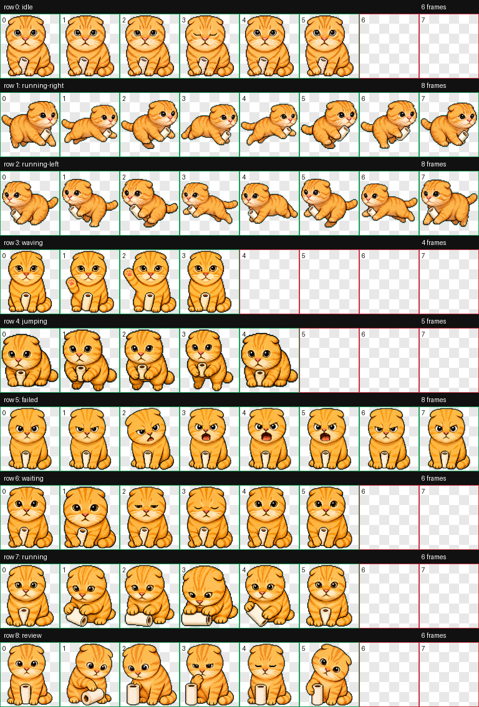

# Maodie_V1

A Codex custom pet based on Maodie / 圆头耄耋:

- Round-headed orange tabby
- Slightly narrower head and slightly smaller body than the first draft
- Tiny white paper-roll prop
- Warning/shouting failed state

## Preview



## Files

- `pet.json`: Codex pet manifest
- `spritesheet.webp`: animated pet spritesheet
- `contact-sheet.png`: preview of all animation rows

## Install

Copy this folder to your local Codex pets directory:

```bash
mkdir -p ~/.codex/pets
cp -R pets/maodie-v1 ~/.codex/pets/
```
